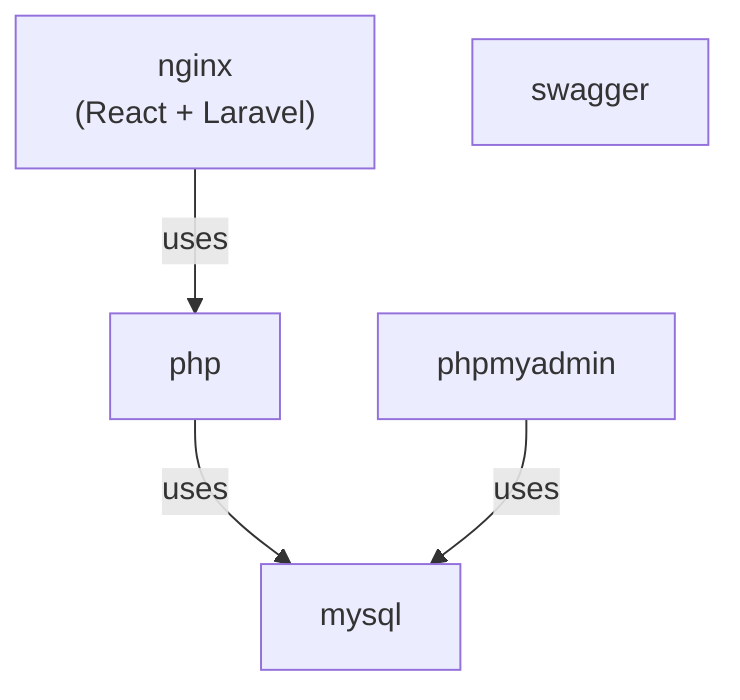

# MultiBook's docker compose

## コンテナ構成図



## コマンド
### 起動
```
docker compose up -d
```
### 停止
```
docker compose down
```
### 起動（ビルド込み）
```
docker compose up -d --build --remove-orphans
```
### コンテナにログイン
(例)
```
docker compose exec nginx /bin/bash
```
### コンテナでコマンド実行
(例)
```
docker compose exec nginx ls -l /var/www/html/backend/public
```
### コンテナ起動時のログ調査
```
docker compose down && docker compose up -d --build --remove-orphans && docker compose logs -f
```
### Laravel単体テスト実行
```
docker compose exec -w=/var/www/html/backend php php artisan test --testdox
```
### Laravel単体テスト実行(ファイル指定)
```
docker compose exec -w=/var/www/html/backend php php artisan test tests/Feature/ImageTest.php --testdox
```
### Laravel単体テスト実行(ファイル、メソッド指定)
```
docker compose exec -w=/var/www/html/backend php php artisan test tests/Feature/ImageTest.php --filter update --testdox
```